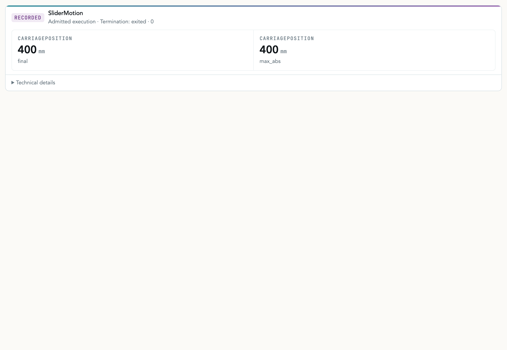

# @casys/mcp-modelica

[](https://jsr.io/@casys/mcp-modelica)
[](https://github.com/Casys-AI/mcp-modelica/actions/workflows/check.yml)
[](LICENSE)

A bounded Modelica provider for approved simulation kits, exact run evidence, and small MCP App
views. It runs OpenModelica; it does not accept arbitrary source, scripts, commands, or paths.



This is the shipped viewer rendering the recorded MCS01 `SliderMotion` capture—not a mock dashboard.
The App keeps `exited · 0`, `ready-for-review`, and the recorded publication/cleanup states literal;
it does not turn execution into a pass, proof, or requirement verdict.

```text
approved kit + bounded parameters
              ↓
        OpenModelica run
              ↓
     sealed hashes + artifacts
              ↓
       one focused MCP view
```

## What it provides

- Qualified `CoffeeMachine` and `LinearThermalRamp` kits with reviewed parameters and scenarios.
- Streamable HTTP and native stdio MCP transports.
- Immutable run ledgers, exact text resources, resumable requests, and bounded CSV summaries.
- Separate run and run-list MCP Apps built from the shared MCP View component kit.
- A strict adapter for recorded Digital Thread `modelica-admitted-execution-capture/2.0` sessions.

`succeeded` means OpenModelica produced a result. Engineering judgement belongs to a separate
constraint or requirement evaluator.

## Run it

The container includes OpenModelica 1.27.0, Modelica Standard Library 4.1.0, and Deno 2.9.6:

```bash
mkdir -p modelica-runs
docker run --rm --name mcp-modelica \
  --publish 127.0.0.1:3016:3016 \
  --volume "$PWD/modelica-runs:/runs" \
  ghcr.io/casys-ai/mcp-modelica@sha256:26bdf32513345e23233a9db7020f45675b4f029803e2f85204fbadd261491360
```

Connect a Streamable HTTP MCP client to `http://127.0.0.1:3016/mcp`; the process health probe is
`http://127.0.0.1:3016/health`. The command pins the signed, multi-architecture `0.6.4` image index.

With the same OpenModelica/MSL runtime already installed, JSR can launch either transport:

```bash
deno run -A jsr:@casys/mcp-modelica@0.6.4/server --port=3016
deno run -A jsr:@casys/mcp-modelica@0.6.4/server --stdio
```

## First useful call

Discover the qualified model, scenario, units, defaults, and bounds with
`modelica_kit_list_recorded`, then submit only reviewed overrides:

```json
{
  "model_id": "coffee-machine-v1",
  "scenario_id": "heat-up-nominal",
  "parameter_overrides": {
    "heater_power": { "value": 1500, "unit": "W" },
    "initial_water_temperature": { "value": 20, "unit": "degC" }
  },
  "timeout_ms": 30000
}
```

Use the resumable manifest → template → submit flow when the caller needs a durable request id and
crash-safe readback. Exact tool and envelope compatibility is documented in
[Contracts and evidence](docs/contracts-and-evidence.md).

## Viewer model

The package ships self-contained run and run-list HTML resources. The default run surface is one
compact semantic object; metrics, parameters, provenance, artifacts, and warnings remain available
as App-owned components for a composing host.

Recorded sessions are read-only projections. A whiteboard host supplies the exact session after the
MCP Apps handshake and grants no provider or solver authority. See
[Recorded viewer sessions](docs/recorded-viewer-sessions.md) for the manifest, schemas, MCS01
identity, component catalog, and literal unavailable states.

## Evidence boundary

- Every persisted artifact is read back and checked against its recorded byte length and SHA-256.
- Source, scenario projection, compiler schema, generated script, diagnostics, CSV, and evidence
  identities stay distinct.
- Missing, changed, ambiguous, or noncanonical evidence fails closed.
- A hash or successful process exit is not a physical requirement verdict.

The provider/runtime boundary, qualified kits, resource URIs, storage limits, and Digital Thread
relationship live in [Provider and runtime](docs/provider-and-runtime.md).

## Development

```bash
deno task check
deno task fmt
deno task lint
deno task test
```

Viewer rebuilding, real OpenModelica gates, generated assets, the documentation capture, and release
workflows are in [Development and release](docs/development-and-release.md).

## Documentation

| Guide                                                        | Contents                                                              |
| ------------------------------------------------------------ | --------------------------------------------------------------------- |
| [Contracts and evidence](docs/contracts-and-evidence.md)     | Frozen, recorded, resumable, error, resource, and digest contracts    |
| [Recorded viewer sessions](docs/recorded-viewer-sessions.md) | MCP App identity, sessions, MCS01 capture, components, and host rules |
| [Provider and runtime](docs/provider-and-runtime.md)         | Qualified kits, isolation, storage, container, and product boundary   |
| [Development and release](docs/development-and-release.md)   | Checkout, UI build, real OMC verification, capture, and publishing    |
| [Changelog](CHANGELOG.md)                                    | Release history                                                       |
| [Security policy](SECURITY.md)                               | Vulnerability reporting                                               |

MIT licensed. Citation metadata is available in [CITATION.cff](CITATION.cff).
